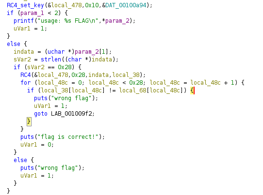
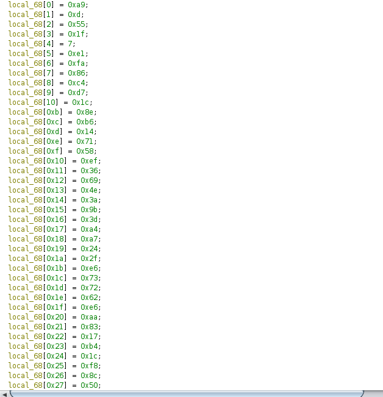

# Crackme-2
решил <a href="https://t.me/bazonavt">@bazonavt</a>

1. Открываем файл в ghidra
2. Здесь используется шифр RC4 с известным ключом в DAT_00100a94



3. Вход шифруется и сравнивается с local_68, значение которой нам даны



4. Так как ключ дан, можно легко расшифровать local_68. Например так:
```python
from Crypto.Cipher import ARC4
import base64

def decr(key, encrypted_data):    
    c = ARC4.new(key)

    return c.decrypt(encrypted_data)

flag = bytes([
    0xa9, 0xd, 0x55, 0x1f, 0x7, 0xe1, 0xfa, 0x86,
    0xc4, 0xd7, 0x1c, 0x8e, 0xb6, 0x14, 0x71, 0x58,
    0xef, 0x36, 0x69, 0x4e, 0x3a, 0x9b, 0x3d, 0xa4,
    0xa7, 0x24, 0x2f, 0xe6, 0x73, 0x72, 0x62, 0xe6,
    0xaa, 0x83, 0x17, 0xb4, 0x1c, 0xf8, 0x8c, 0x50
]) # local_68

ans = decr(b'\xf5\x7b\xe7\x6c\xd3\xd1\x4f\x31\xe3\xa8\x50\x53\x83\x64\xcc\x56', flag)

for i in ans:
    print(chr(i), end="")
```
5. Таким образом, получаем флаг


