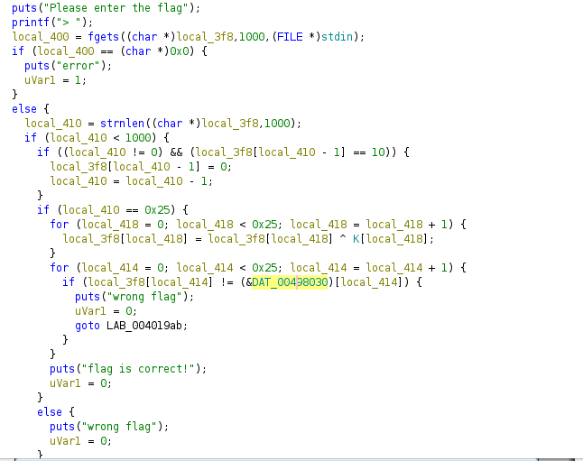

# Crackme
решил <a href="https://t.me/bazonavt">@bazonavt</a>

1. Открываем файл в ghidra
2. Видим, что у нас происходит посимвольный xor флага с K
<!--  -->

3. Далее видим, что xorенный флаг сравнивается с DAT_00498030
4. Если нужно ввести флаг в программу, то DAT_00498030 - флаг заксоренный с K
5. Копируем DAT_00498030 и xorим его с K и получаем флаг, так как a ^ a = 0

