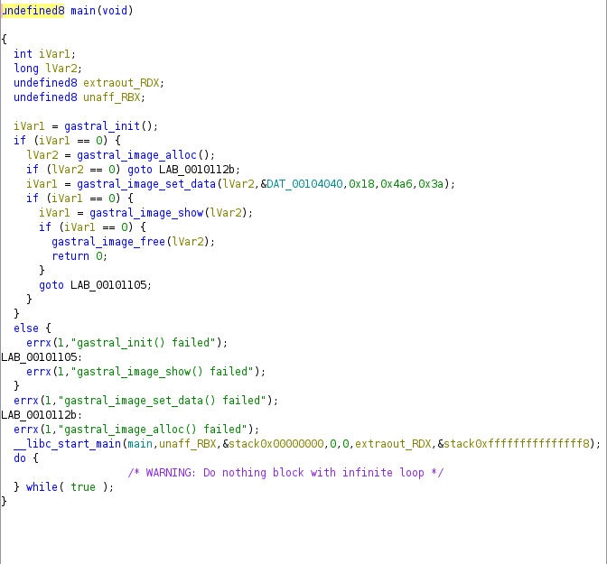

# libgastral
решил <a href="https://t.me/bazonavt">@bazonavt</a>

1. Открываем файл в ghidra
2. `gastral_init`, `gastral_image_alloc`, `gastral_image_set_data`, `gastral_image_show` намекают на то, что gastral - библиотека для работы с картинками

3. `gastral_image_set_data` загружает данные из DAT_00104040. Вероятно, это картинка, а параметры 0x4a6, 0x3a - ширина и высота картинки соответственно
4. Копируем DAT_00104040 в отдельный файл под расширением .data, открываем в GIMP и ставим ширину и высоту картинки
5. Получаем картинку с флагом

