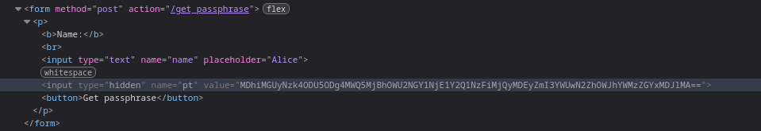

# Alice
решил <a href="https://t.me/bazonavt">@bazonavt</a>

1. В encrypt.py видим уязвимость: iv детерминированно генерируется на основе name
2. AES в режиме CBC шифрует первый блок С следующим образом: `AES(C ^ iv)`, а все последующие блоки зависят от предыдущего
3. Значит, получив первый блок такой же как у alice мы получим её passphrase
4. Видим, что при генерации passphrase на сайте, подставляется значение pt



5. Если мы модифицируем первый блок pt так, чтобы он был равен `C ^ MD5(alice) ^  MD5(bob)`, то если мы зашлем на сервис такой pt c именем bob, первый блок passphrase будет равен `AES(C ^ MD5(alice) ^  MD5(bob) ^ MD5(bob)) = AES(C ^ MD5(alice))`
6. Таким образом, мы можем получить passphrase для alice:
```python
from base64 import b64encode, b64decode
from Crypto.Hash import MD5


def solve(data, s, t):
    pt_orig = b64decode(data)
    iv_bob = MD5.new(s.encode('utf-8')).digest()
    iv_alice = MD5.new(t.encode('utf-8')).digest()

    d = bytes(a ^ b for a, b in zip(iv_bob, iv_alice))
    
    payload = bytearray(pt_orig)

    for i in range(min(16, len(payload))):
        payload[i] ^= d[i]
    
    return b64encode(payload).decode('utf-8')

print(solve(pt_from_the_browser, "bob", "alice"))
```
7. Делаем /get_passphrase с полученным `pt_from_the_browser` и именем bob, получаем passphrase
8. Переходим в /get_secret, пишем имя alice, вставляем полученную passphrase
9. Получаем флаг
