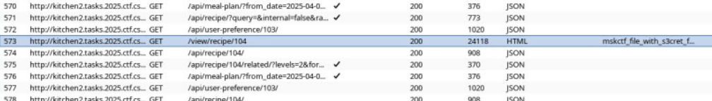
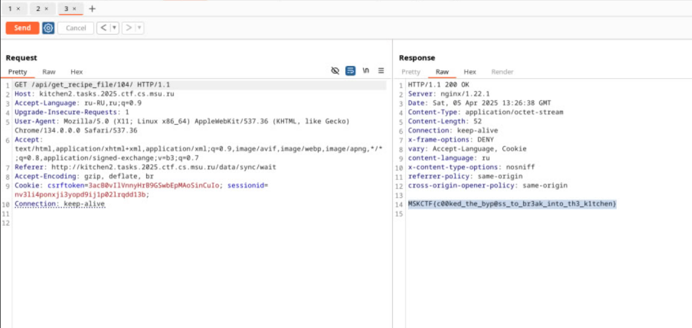

# Kitchen 2
решил <a href="https://t.me/bazonavt">@bazonavt</a>

1. На первый взгляд на сервисе зарегистрироваться невозможно, так как `signup` в ссылке блокируется
2. Пробуем url-закодировать signup в ссылке, получаем `/accounts/%73%69%67%6e%75%70` (сначала стоит попробовать через repeater в Burp Suite)
3. Теперь можно зарегистрироваться, регистрируемся
4. Пробуем эксплоит из kitchen, не выходит: сервис обновился
5. Смотрим другие уязвимости во вкладке security на github. Так как флаг содержится в файле, нам подходит уязвимость Local file disclosure. Данную уязвимость исправили только в 1.5.28, а версия на сервере - 1.5.24 (можно найти во вкладке API)
6. Выполняем все в соответствии с <a href="https://github.com/TandoorRecipes/recipes/security/advisories/GHSA-jrgj-35jx-2qq7">инструкцией</a> для папки `/etc`, так как там лежит флаг
7. Находим файл, начинающийся с `mskctf_`, нажимаем на него, импорируем как рецепт
8. Просматриваем его как рецепт и смотрим http history в burp. 

9. Видим, что в данном случае рецепт имеет id 104
10. Делаем следующий запрос и получаем флаг:

